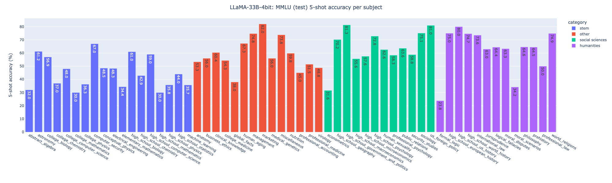

# EXPERT: EXtremely Parameter Efficient loRa Tuning

About:   

## Table of Contents

- [Preparation](#preparation)
- [PubMedQA](#pubmedqa)
- [MMLU](#mmlu)

## Preparation
Experiments are based on the code from [alpaca_lora_4bit](https://github.com/johnsmith0031/alpaca_lora_4bit), with modifications for specific tasks.

- [ ] Add more details: bitsandbytes installation is tricky

## PubMedQA

- [ ] Add more details: how to prepare prompt (and response)

### Single 24G GPU: 500 samples 10 epochs in 3 hours
```
CUDA_VISIBLE_DEVICES=0 python finetune.py pubmedqa_train.json \ 
    --ds_type gpt4all --lora_out_dir PATH_TO_SAVE_LORA \
    --llama_q4_config_dir PATH_TO_LLAMA_DIR \ 
    --llama_q4_model PATH_TO_LLAMA_WEIGHT \
    --val_set_size 0.0 --grad_chckpt --mbatch_size 2 --cutoff_len 512 \ 
    --warmup_steps 10 --save_steps 10 --save_total_limit 10 --epochs 10 \ 
    --batch_size 50 --lr 1e-4 
```

### Comparisons: reasoning-required setting
| Model                                | Accuracy (%) | F1 (%) | Size      |
| -------------------------------------|--------------| -------|-----------|
| GPT-3.5 + Z-Code++                   | 79.6         | 55.8   | 175B      |
| Flan-PALM (3-shot)                   | 79.0         | NA     | 540B      |
| Codex (5-shot)                       | 78.2         | NA     | 175B      |
| Human Performance                    | 78.0         | 72.2   | NA        |
| Galactica (0-shot)                   | 77.6         | NA     | 120B      |
| **LLaMA-33B-4bit (tuned with LoRA)** | 75.6         | 54.1   | 33B + 20M |
| GPT-4 (0-shot)                       | 75.2         | NA     | NA        |
| GPT-4 (5-shot)                       | 74.4         | NA     | NA        |
| PubMedGPT                            | 74.4         | NA     | 2.7B      |

## MMLU

- [ ] Add more details: how to prepare prompts

### Comparisons: 5-shot test accuracy (%)
| Model              | Humanities  | STEM        | Social Sciences | Other        | Average    |
|--------------------|-------------|-------------|-----------------|--------------|------------|
| LLaMA-13B          | 45.0        | 35.8        | 53.8            | 53.3         | 46.9       |
| LLaMA-33B          | 55.8        | 46.0        | 66.7            | 63.4         | 57.8       |
| **LLaMA-33B-4bit** | 62.0 (+6.2) | 44.9 (-1.1) | 64.1 (-2.6)     | 58.6 (-4.8)  | 56.2 (-1.6)|

### Detailed results: LLaMA-33B-4bit model

